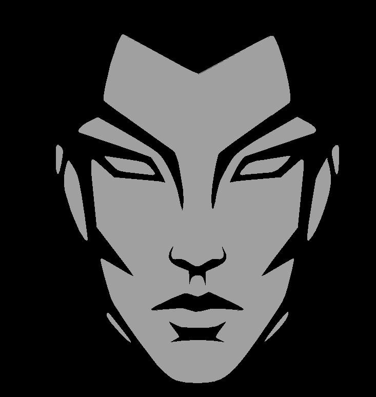

This repo is a part of NoABS initiative - a collection of tools that fix Eagle CAD's rough edges.

ACCESS TOOL [HERE](https://j3qq4hch.github.io/NoABS.EagleLogo/).

Bitmap import in Eagle is a nightmare. It basically reconstructs bitmap but inside Eagle itself, which creates a huge number of excessive rectangular objects in the PCB. Although, I should admit, this won't slow eagle down that bad, but this is still a wrong approach.

This little tool accepts any bitmap image (no limits on colors), then makes it black and white, vectorizes it and creates a script to generate a picture shaped polygon in Eagle CAD. 

The UI is self explanatory, except for one little thing. Due to how Eagle handles polygons it can't have polygons with windows on silkscreen layers. This is why the tool makes a little cut unnoticeable on each such polygon, transforming it to a polygon that Eagle can render properly while maintaining the shape of the picture. Basically O-shaped thing transforms to C-shaped, but the opening is really small (Seam width), so it can't be seen by eye.

Notice about data upload. This thing does no require uploading your data anywhere. It all runs local on your own machine, browser is just a wrapper. 

Below are some examples of the tool output:

| Source picture | Eagle polygon |
|----------------|---------------|
| | |
| | |
| | |

Happy using!